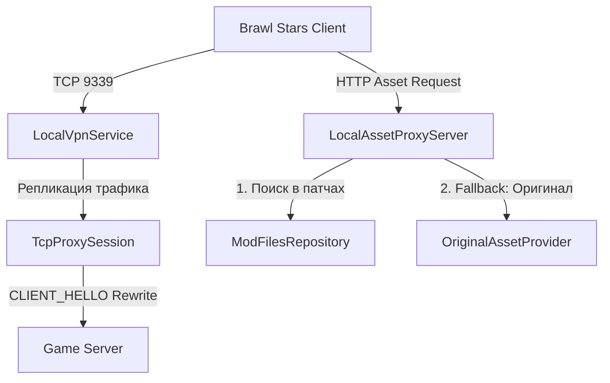

# BSML (Brawl Stars Mod Loader) 🚀

  

**BSML** — это современный, полностью локальный загрузчик модов для Brawl Stars (и других совместимых игр Supercell) на платформе Android. Проект позволяет динамически накладывать, комбинировать и удалять моды «на лету» без необходимости модификации, декомпиляции или переподписи оригинального APK-файла игры и без использования прав Root.

## 🛠️ Техническое устройство (Как это работает?)

Архитектура BSML состоит из нескольких взаимосвязанных компонентов, работающих на сетевом и прикладном уровнях Android:

### 1. Перехват трафика на уровне ядра (Local VPN)
* BSML запускает локальный Android-сервис `LocalVpnService`. 
* Он настраивает виртуальный сетевой интерфейс (TUN) с IP-адресом `10.10.10.2` и перехватывает исходящие TCP-пакеты, адресованные на порт игрового сервера (`9339`).
### 2. Анализ пакетов и подмена Content-Hash (CLIENT_HELLO Rewrite)
* Игровой клиент начинает сессию с отправки сообщения `CLIENT_HELLO` (ID `10100`), содержащего текущий `contentHash` (хеш-отпечаток игровых ассетов).
* Класс `TcpProxySession` перехватывает этот буфер на лету. 
* Если в BSML активирован мод, оригинальный `contentHash` подменяется на кастомный SHA-хеш (с префиксом пространства имен патча).
* Игровой сервер видит «неверный» хеш и сообщает клиенту о необходимости загрузить обновленные файлы ассетов, отправляя в ответ пакет `LoginFailedMessage` с указанием адреса для скачивания ресурсов.

### 3. Локальный HTTP-прокси для ресурсов (Local Asset Proxy)
* BSML запускает собственный фоновый веб-сервер `LocalAssetProxyServer` на локальном хосте.
* Перехваченные HTTP-запросы от игры на скачивание ресурсов перенаправляются на этот локальный прокси.
* Прокси-сервер анализирует, какие файлы запрашивает игра:
  1. Если файл модифицирован установленным модом, прокси отдает предварительно скомпилированный патч из рабочей директории.
  2. Если файл не изменен модом, `OriginalAssetProvider` лениво отдает оригинальный файл (из кэша, ресурсов игры или скачивает его из официального CDN, если его нет локально).

### 4. Компиляция и разжатие CSV-патчей
* Моды поставляются в виде архивов с расширением `.NullsBrawlAssets` или обычных `.zip`.
* Класс `CsvPatchApplier` выполняет точечное слияние изменений из мода с оригинальными CSV-таблицами игры.
* Полученные CSV-файлы сжимаются с помощью оригинального алгоритма разжатия `daniillnull.tools.LZMA` на базе SDK SevenZip. Это гарантирует, что игра получит структуру данных в точности того формата (с 5-байтовым заголовком свойств и 4-байтовым заголовком размера), который она ожидает.

### 5. Безопасное отключение и очистка (Cleanup Mode)
* При деактивации мода запускается «режим очистки» (`cleanupMode`).
* BSML принудительно отправляет оригинальный `contentHash` игры в пакете `CLIENT_HELLO`.
* Игра запрашивает оригинальные ассеты, локальный прокси возвращает оригинальные файлы, и кэш игры полностью восстанавливается до ванильного состояния.
* Сразу после этого VPN-интерфейс автоматически отключается (`autoVpnDisable`), снижая нагрузку на процессор и батарею.

---

## 📦 Требования и технологии

* **Минимальная версия Android:** 7.0 (API 24+)
* **Стек технологий:** Kotlin (Jetpack Compose для UI), Java, Coroutines, Flow.
* **Основные библиотеки:**
  * `org.b1.pack:lzma-sdk-4j` — декодирование и кодирование LZMA-потоков SevenZip.
  * `androidx.compose` — современный реактивный интерфейс.
