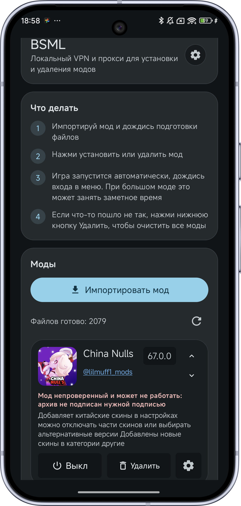
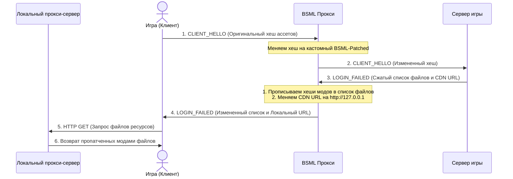

[English version](README_EN.md)

# BSML (Brawl Stars Mod Loader) 🚀

[Скачать последнюю версию](https://github.com/lilmuff2/bsml/releases/latest)

  

**BSML** — это современный, полностью локальный загрузчик модов для Brawl Stars (и других совместимых игр Supercell) на платформе Android. Проект позволяет динамически накладывать, комбинировать и удалять моды «на лету» без необходимости модификации, декомпиляции или переподписи оригинального APK-файла игры и без использования прав Root.

## 🛠️ Техническое устройство (Как это работает?)

Архитектура BSML состоит из нескольких взаимосвязанных компонентов, работающих на сетевом и прикладном уровнях Android:

### 1. Перехват трафика на уровне ядра (Local VPN)
* BSML запускает локальный Android-сервис `LocalVpnService`. 
* Он настраивает виртуальный сетевой интерфейс (TUN) с IP-адресом `10.10.10.2` и перехватывает исходящие TCP-пакеты, адресованные на порт игрового сервера (`9339`).
### 2. Анализ пакетов и подмена Content-Hash (CLIENT_HELLO & LOGIN_FAILED Rewrite)

Взаимодействие между игрой и сервером перехватывается классом `TcpProxySession`. Прокси-сервер осуществляет глубокий разбор (Deep Packet Inspection) и модификацию пакетов протокола Supercell на лету.

#### 1️⃣ Пакет `CLIENT_HELLO` (ID `10100`)
Отправляется клиентом игры при инициализации сетевого соединения. Пакет имеет следующую структуру:
* `protocolVersion` (Int32, смещение 0) — версия сетевого протокола.
* `keyVersion` (Int32, смещение 4) — версия публичного ключа шифрования.
* `major` (Int32, смещение 8) — мажорная версия игры (например, `55`).
* `revision` (Int32, смещение 12) — ревизия сборки.
* `build` (Int32, смещение 16) — номер сборки.
* `contentHash` (String, смещение 20) — 40-символьный SHA-1 хеш-отпечаток текущей версии оригинальных ассетов игры (префиксируется 4-байтным Big-Endian размером строки; `-1` указывает на `null`).

**Логика модификации:**
Если в приложении активированы моды, `TcpProxySession` перехватывает `CLIENT_HELLO` и подменяет `contentHash` на кастомную строку с префиксом `PATCH_NAMESPACE` (константа `BSML-Patched-` с суффиксом сигнатуры состояния модов). Игровой сервер сверяет этот хеш, понимает, что у клиента «устаревшие» файлы, и инициирует процедуру обновления ассетов.

#### 2️⃣ Пакет `LOGIN_FAILED` (ID `20103` / `0x4E87`)
Отправляется игровым сервером в ответ на «устаревший» `contentHash`. Пакет разбит на две логические части:

**А. Префикс пакета (`LoginFailedPrefix`):**
* `reason` (Int32) — код ошибки (код `7` означает `CLIENT_CONTENT_UPDATE` — требование обновления файлов, код `1` — общая ошибка входа).
* `fingerprint` (String?) — plain-текст fingerprint JSON (в старых версиях игры).
* `unknownString` (String?) — зарезервировано.
* `contentDownloadUrl` (String?) — базовый URL CDN, откуда игра должна скачать ресурсы (например, `https://event-assets.brawlstars.com`).
* `updateUrl` (String?) — ссылка на страницу обновления игры в Google Play.
* `reasonText` (String?) — текст ошибки, отображаемый пользователю.
* `maintenanceWaitSecs` (Int32) — время ожидания при тех. работах.
* `suffix` (ByteArray) — хвост пакета, содержащий сжатый фингерпринт и резервные адреса.

**Б. Суффикс пакета (`LoginFailedTail`):**
* `unknownBoolean` (Boolean / 1 байт) — служебный флаг.
* `compressedFingerprint` (ByteArray?) — фингерпринт-JSON, сжатый с помощью zlib/gzip (префиксирован 4-байтным Big-Endian размером сжатого буфера). Распакованный буфер имеет 4-байтный Little-Endian заголовок исходного размера, после которого идет сам поток zlib.
* `contentDownloadUrls` (List<String>) — массив резервных CDN URL-адресов для скачивания файлов, начинающийся с 4-байтного Int32-счетчика количества строк.
* `rawSuffix` (ByteArray) — оставшиеся байты пакета.

**Логика модификации:**
При получении `LOGIN_FAILED` от игрового сервера, `LoginFailedRewriter` выполняет следующие шаги:
1. **Декомпрессия (`inflate`):** Извлекает `compressedFingerprint` из суффикса, определяет алгоритм сжатия (zlib с Little-Endian префиксом длины, чистый zlib, gzip или deflate) и распаковывает его в исходный JSON-фингерпринт.
2. **Патчинг JSON:**
   * Подменяет корневой параметр `"sha"` фингерпринта на хеш, соответствующий перехваченному `contentHash` из `CLIENT_HELLO`.
   * Обходит массив `"files"` и для каждого файла, измененного модом (полученного из `ModFilesRepository`), подменяет оригинальный `"sha"` на SHA-1 патченного файла, а также записывает его реальный размер.
   * Добавляет в список файлов фиктивный триггер-файл (`PATCH_NAMESPACE` со случайным SHA-1 хешем), гарантируя, что игра обнаружит изменения и запустит загрузку.
3. **Компрессия (`deflate`):** Упаковывает модифицированный JSON обратно в соответствующий формат сжатия с вычислением новых размеров.
4. **Редирект CDN:** Переписывает поле `contentDownloadUrl` в префиксе и весь список `contentDownloadUrls` в суффиксе, заменяя оригинальные CDN-адреса на адрес локального прокси-сервера: `http://127.0.0.1:<localAssetPort>`.
5. **Сборка пакета:** Кодирует обновленные структуры префикса и суффикса обратно в бинарный поток, формирует стандартный заголовок пакета Supercell (ID сообщения, длина тела, версия) и отправляет его игровому клиенту.

### 3. Локальный HTTP-прокси для ресурсов (Local Asset Proxy)
* BSML запускает собственный фоновый веб-сервер `LocalAssetProxyServer` на локальном хосте.
* Перехваченные HTTP-запросы от игры на скачивание ресурсов перенаправляются на этот локальный прокси.
* Прокси-сервер анализирует, какие файлы запрашивает игра:
  1. Если файл модифицирован установленным модом, прокси отдает предварительно скомпилированный патч из рабочей директории.
  2. Если файл не изменен модом, `OriginalAssetProvider` лениво отдает оригинальный файл (из кэша, ресурсов игры или скачивает его из официального CDN, если его нет локально).

### 4. Компиляция и разжатие CSV-патчей
* Моды поставляются в виде архивов с расширением `.NullsBrawlAssets` или обычных `.zip`.
* Класс `CsvPatchApplier` выполняет точечное слияние изменений из мода с оригинальными CSV-таблицами игры.
* Полученные CSV-файлы сжимаются с помощью оригинального алгоритма разжатия `daniillnull.tools.LZMA` на базе SDK SevenZip. Это гарантирует, что игра получит структуру данных в точности того формата (с 5-байтовым заголовком свойств и 4-байтовым заголовком размера), который она ожидает.

### 5. Безопасное отключение и очистка (Cleanup Mode)
* При деактивации мода запускается «режим очистки» (`cleanupMode`).
* BSML принудительно отправляет оригинальный `contentHash` игры в пакете `CLIENT_HELLO`.
* Игра запрашивает оригинальные ассеты, локальный прокси возвращает оригинальные файлы, и кэш игры полностью восстанавливается до ванильного состояния.
* Сразу после этого VPN-интерфейс автоматически отключается (`autoVpnDisable`), снижая нагрузку на процессор и батарею.

---

## 📦 Требования и технологии

* **Минимальная версия Android:** 7.0 (API 24+)
* **Стек технологий:** Kotlin (Jetpack Compose для UI), Java, Coroutines, Flow.
* **Основные библиотеки:**
  * `org.b1.pack:lzma-sdk-4j` — декодирование и кодирование LZMA-потоков SevenZip.
  * `androidx.compose` — современный реактивный интерфейс.
