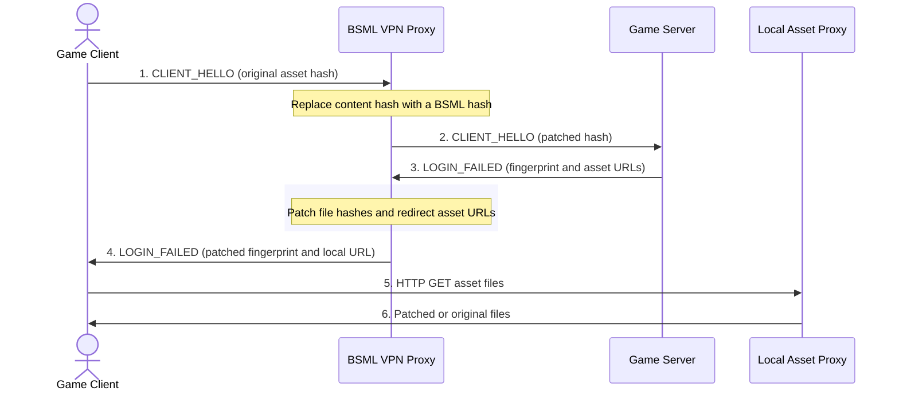

# BSML (Brawl Stars Mod Loader)

  

**BSML** is a modern, fully local Android mod loader for Brawl Stars and compatible Supercell games. It can install, combine, update, and remove mods without modifying, decompiling, re-signing, or replacing the original game APK, and it does not require root access.

## How It Works

BSML works as a local VPN and asset proxy. It intercepts the game asset update flow, rewrites the asset fingerprint, and serves patched files locally when the game requests them.

## Main Features

- Installs mods without changing the original APK.
- Uses a local Android VPN service instead of root permissions.
- Supports imported `.NullsBrawlAssets`, `.nbassets`, and `.nbssets` archives.
- Supports direct folder mode when no imported mod is active.
- Can combine multiple imported mods and selected features.
- Compiles CSV patches from mod metadata and original game files.
- Serves patched files through a local asset proxy.
- Can remove installed mods and restore original game assets.
- Supports global and China game variants where the protocol flow allows it.

## Architecture

### 1. Local VPN

`LocalVpnService` creates a local Android VPN interface and routes selected game traffic through BSML. The app can filter traffic by IP/host or by package name and target the Supercell game port, usually `9339`.

### 2. Supercell Protocol Rewriting

`TcpProxySession` parses Supercell packets and rewrites the content update flow:

- `CLIENT_HELLO` (`10100`) contains the client version and current asset hash.
- `LOGIN_FAILED` (`20103`) can contain the asset fingerprint, CDN URLs, and update reason.

When installing a mod, BSML changes the client content hash so the server sends a fresh fingerprint. Then `LoginFailedRewriter` patches that fingerprint:

- updates hashes and sizes for changed files;
- changes the root fingerprint SHA when needed;
- adds an internal trigger file when a forced download pass is needed;
- redirects asset URLs to the local asset proxy;
- recompresses the fingerprint in the format expected by the game.

### 3. Local Asset Proxy

The local asset proxy serves files requested by the game:

- patched files come from the prepared mod cache;
- unchanged files are passed through or loaded from the original asset cache;
- missing originals can be fetched from the saved asset origins when available.

### 4. Mod Preparation

`ModFilesRepository` prepares files before installation. For imported NullsBrawlAssets-style mods, BSML reads the archive, applies enabled features, compiles CSV changes against original game CSV files, and creates a prepared file index with SHA-1 hashes.

For direct folder mode, BSML prepares all files from the selected folder and uses them as patched assets.

### 5. Cleanup Mode

Cleanup mode removes installed changes from the game cache. BSML sends a cleanup fingerprint, serves the required original or trigger files, and waits for the game to return to the original content hash. If auto-disable is enabled, the VPN is stopped after the final `CLIENT_HELLO`.

## Requirements

- Android 7.0 or newer (API 24+)
- No root required
- Original game APK installed

## Tech Stack

- Kotlin
- Jetpack Compose
- Android VPN Service
- Coroutines and Flow
- Local TCP/HTTP proxying
- LZMA/zlib/gzip fingerprint and CSV handling

## Notes

BSML is a local tool for applying user-selected asset mods. Compatibility depends on the current game version, the fingerprint returned by the game server, and the structure of the imported mod archive.
